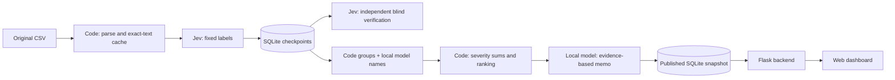

# Spotify review insight pipeline

This project turns historical Spotify app reviews into a reproducible product-priority analysis. The final route uses Jev for fixed classification and independent verification, SQLite/code for state and arithmetic, and local Ollama for bounded issue naming and memo writing. The approved analysis is complete: 100,000 nonempty reviews classified and 13 empty texts quarantined. Coverage, ranking and provenance checks have no flags; unavailable provider usage on failed requests is disclosed in `evidence/audit-disclosure.json`. The published backend retrieves the final processed data, rankings and memo from a deployed read-only SQLite database.

Live dashboard: https://spotify-review-insights-three.vercel.app (final approved analysis).

## Scope and current evidence

The student reports that the professor approved **100,000 nonempty reviews** and an API budget no higher than **$10**. `data/analysis_100000.csv` contains 100,000 deterministically selected nonempty rows plus the 13 empty rows, with 78,099 distinct nonempty texts. Selection preserves every original field, includes the fixed checkpoints and golden raw texts, and is documented in `evidence/analysis_scope.json`. This is a reduced analysis scope, not full-corpus classification. The entire 660,622-row source was profiled separately in `evidence/ingestion.json`.

**Human labeling is complete:** 50/50 valid records, including 7 needs-review flags. See `evidence/golden_completion.json` and `evidence/golden_50_human.csv`. Human answers never enter prompts. An immutable timestamped backup preserves the original labels. Held-out agreement: topic 78%, intent 82%, severity 72%; severity MAE 0.38. The real 100-review pipeline took 53.95 seconds and $0.005730144 in known API charges; warm replay took 0.149 seconds with no new model calls. See `cost/jev/report.md`.

## Setup and execution

Use Python 3.11+ and local Ollama with `gemma3n:e4b-it-q4_K_M`. Python code uses the standard library. Create a TypeSafe API key at https://console.typesafe.ai/keys and save it only in the ignored project `.env` as `TYPESAFE_API_KEY=...`. Never include it in logs, screenshots or submissions. The blank `.env.example` is safe to commit.

The following are separate commands, not an automatic instruction to run every checkpoint before inspecting results:

```sh
# Explicit paid pilot: unchanged cost_100.csv, empty result cache, one worker.
python3 jev_pipeline.py --execute-paid --pilot --root runs/jev-pilot
python3 jev_pipeline.py --execute-paid --pilot --warm --root runs/jev-pilot
# Offline calculator: no key, network or model calls.
python3 jev_calculator.py
# Synthetic checks: isolated from business records, same shared spend ledger.
python3 jev_system_checks.py --execute-paid
# Actual interruption and recovery on the 500 checkpoint.
python3 recovery_demo.py --provider jev --execute-paid --input data/checkpoint_500.csv --out runs/jev-500
# Complete downstream stages using the recovered database.
python3 jev_pipeline.py --execute-paid --resume --input data/checkpoint_500.csv --root runs/jev-500
# After inspecting quality, costs and runtime, expand using one shared state DB.
python3 jev_pipeline.py --execute-paid --resume --input data/analysis_10000.csv --root runs/jev-500
python3 jev_pipeline.py --execute-paid --resume --input data/analysis_100000.csv --root runs/jev-500
# Final evaluation does not call a model.
python3 evaluate.py --predictions runs/jev-500/resume/records.jsonl
# Deterministic ranking, also offline.
python3 stages.py --records runs/jev-500/resume/records.jsonl --settings runs/jev-500/resume/settings.json --out runs/recomputed --rank-only
python3 -m unittest discover -s tests -v
```

The shared `runs/project_budget.sqlite` ledger reserves cost before requests, includes all paid retries/verification, and stops new dispatch at $9 including unknown/in-flight reservations, keeping a $1 margin. Unknown usage is not assumed free. The provider's delayed billing remains a limitation of local spend guarantees. Jev pricing is editable in `cost/jev_rates.csv`, dated and sourced to https://docs.typesafe.ai/models. Actual projections require the completed cold/warm pilot. No stronger paid model fallback is configured.

Completed records and exact-text results are reused only under an unchanged configuration. Failed/quarantined records remain visible; a successful accounting record is not a successful classification. Never erase state to conceal failures. The original local-only experiments and their offline calculator are retained in `runs/pilot-v2`, `cost/`, `pilot.py`, and `calculator.py` as historical development evidence; their results do not stand in for Jev results.

## Roles and control flow

1. **Prepare — code.** Parse quoted multiline CSV, preserve all six field strings, validate source hashes, deduplicate exact text and look up saved results. Empty text is quarantined explicitly.
2. **Enrich — Jev plus code.** The model chooses topic, intent, sentiment, severity and needs-review one review per request. Code extracts exact glossary terms and attaches the original text as the evidence span. It validates the output and retries an invalid response at most once before quarantine.
3. **Verify — independent Jev task plus code.** A separately instructed task receives original text without the first prediction. The sample is the lowest hashes of `verify-seed-v1:review_id`, at 10% for the pilot and 1% for larger checkpoints/final analysis, with a minimum of ten (or all records when fewer than ten exist). Disagreements are reported without overwriting labels. Using the same underlying model can preserve shared biases.
4. **Group — code plus bounded model task.** Each completed complaint/cancellation belongs to one stable primary-topic issue. The model names those groups from at most three examples each; it does not decide counts. Coarse topic grouping is a declared limitation.
5. **Rank — code.** Sum severity within each issue, count each ID once, exclude praise/request/unclear, sort score descending then issue ID ascending. Means use decimal half-up rounding to six places.
6. **Recommend — bounded local model task plus code.** The model consumes only aggregate counts and traceable examples. Code validates issue/review references and inserts measured numeric claims and claim IDs into the memo.

The orchestrator owns dispatch, validation, state and stopping. Roles have separate prompts, inputs, outputs and logs. It uses a fixed workflow because adaptive tool use adds no demonstrated value to this labeling task. The pilot uses one worker; at most two workers are permitted for subsequent runs. Shared request/token allowances and budget reservations bound dispatch. Local compute costs are unmeasured, not assumed zero.

## Evaluation rules declared before human comparison

Use the eight topics, five intents and shared severity definitions in `course/GRADING_CONTRACT.md`. Sentiment uses −1 (strongly negative), −0.5 (negative), 0 (neutral/mixed/unclear), 0.5 (positive), 1 (strongly positive). Evaluation reports sentiment MAE and agreement within ±0.5, severity exact agreement and MAE, topic/intent/needs-review agreement, evidence substring membership and entity-set agreement. Missing predictions stay in the agreement denominator. Quote membership and valid types do not establish label correctness.

All 50 human labels are complete. The evaluator requires all 50 before `evaluate.py` produces final evaluation. Do not use golden failures to tune prompts without disclosing the change and adding fresh held-out cases. Foreign-language or ambiguous input is not discarded; the model must flag uncertainty. The full original evidence span preserves exact wording but still needs semantic inspection.

Severity examples (synthetic, not golden cases): “Love it” → 1; “Bad app” → 2; “Playback stutters but resumes” → 3; “Cannot log in at all” → 4; “Unauthorized charges emptied my account” → 5. “I am cancelling because it is expensive” does not by itself establish serious financial harm.

## Evidence and current limitations

- `evidence/ingestion.json`: full-file source profile, produced by supplied checker.
- `runs/benchmark/`: real first failed experiment, retained. The model invented entity mentions and modified evidence quotes.
- `runs/benchmark-v2/`: revised 10-review structural benchmark using code extraction as recommended by the assignment. This is not an accuracy score or the complete cost pilot.
- `runs/pilot-v2/`: real 100-review cold/warm pipeline evidence as generated.
- `cost/rates.csv`: editable zero-API local rates; `calculator.py` replays saved usage offline.
- `tests/`: source fidelity, validation and ranking checks.
- `evidence/system-tests/`: planted-label and injection tests, isolated from business records.

Large generated files live outside source control until packaged as downloadable evidence. Before submission, package the required `grading/` and `cost/` artifacts, add an interruption/resume recording, finish human/model evaluation, run the approved 100,000-review scope, deploy the dashboard/backend/database, and verify public access. The 500-review checkpoint is a classroom milestone, not the final deliverable. No analysis should claim observed churn, revenue at risk, causality or representativeness from these self-selected historical reviews.

## Sources and technical references

- Course-supplied `course/GRADING_CONTRACT.md`, `course/COST_CALCULATOR.md`, `course/manifest.json` and checker define the required outputs.
- Original data: https://www.kaggle.com/datasets/bwandowando/3-4-million-spotify-google-store-reviews (version 2).
- Full course CSV SHA-256: `1fc85de68a304dd8978b537cfa58793d5f41cbaf417fa32cb53899f83a2fcef6`.
- Structured output reference: https://github.com/ollama/ollama/blob/main/docs/capabilities/structured-outputs.mdx
- Assignment-recommended fixed-choice alternative: https://docs.typesafe.ai/primitives/choice

Reference choices are assessed against measured throughput, quality and cost. Provider marketing speedups are not treated as our benchmark results.

## Rubric evidence map

| Criterion | Inspectable evidence |
|---|---|
| Deliverable quality | This README, source code, `course/GRADING_CONTRACT.md`, versioned settings/call logs, stage memo and claims |
| Testing and evaluation | `evidence/golden_evaluation.json`, `evidence/golden_error_analysis.md`, `evidence/jev-system-tests/report.json`, `cost/jev/`, interruption recording in run evidence |
| Working result | `evidence/ingestion.json`, `evidence/analysis_scope.json`, `evidence/jev-500-self-check.json`, saved classifications/ranking and live dashboard |

The 500-review mechanical audit passes against the supplied 500-review reference. This does not establish final coverage or a final grade. The actual recovery retained 138 completed IDs and added 362, with no reclassification of already completed IDs.



The UI never calls a model. It retrieves saved records, calculated rankings and recommendations from the deployed database through the backend. The deployment uses the existing Vercel Hobby plan. The local runner's `runs/` state remains the recovery source of truth.

## Final measured result

- Classified: 100,000; empty quarantines: 13; pending: 0. Original full source: 660,622 rows, profiled separately.
- Project-wide known API cost: $4.091135; unresolved/in-flight reservations: $0.151388. These are usage-based costs and conservative reservations, not a provider invoice.
- Local hardware/energy costs remain unmeasured. The API authorization was $10, with a $9 dispatch stop.
- Final machine-checkable audit: `evidence/final-self-check.json`. This validates artifacts, not semantic truth or a final grade.
- Final decision memo: `evidence/final-memo.md`; human/model comparison: `evidence/golden_evaluation.json`.
- Download input sample, grading artifacts, recovery evidence, costs and final outputs from the [final-analysis release](https://github.com/gracecao1997/spotify-review-insights/releases/tag/final-analysis).
